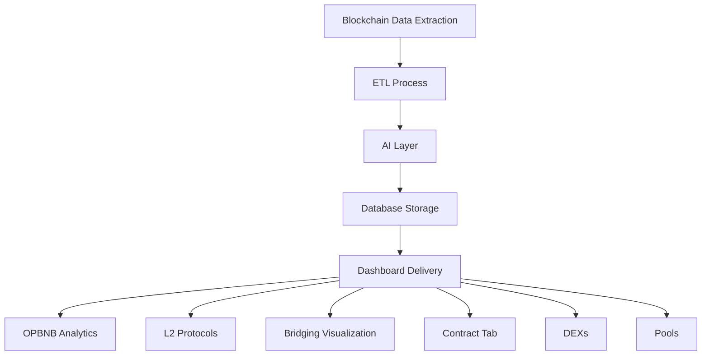

### L2-Board: AI-Driven Analytics Dashboard for BNB Chain Layer 2 Ecosystem

---

#### Overview

L2-Board is an advanced analytics dashboard designed to provide comprehensive insights into the BNB Chain's Layer 2 (L2) ecosystem. Our platform leverages AI agents built with large language models (LLMs) that are continuously trained and refined over time. These AI agents extract, verify, interact, and summarize data across multiple L2 solutions, offering users real-time, actionable insights. Built with the needs of developers, investors, and blockchain enthusiasts in mind, L2-Board delivers a holistic view of the L2 landscape, addressing key metrics such as TVL, transaction volumes, and more.

---

### Features

#### 1. OPBNB Analytics

- **Comprehensive Analytics:** Gain deep insights into OPBNB, including metrics such as deposits, withdrawals, transactions, volume, and TVL over time.
- **AI Insights:** Our LLM-based AI agents summarize each metric, providing clear, concise interpretations to help users make informed decisions.

#### 2. L2 Protocols

The L2 Protocols section offers detailed analytics on various protocols operating within the OPBNB Layer 2 ecosystem. Currently, L2-Board supports the following protocols, and we are actively working to add more over time:

- **Myshell AI:** MyShell is building an AI consumer layer that connects users, creators, and open-source AI researchers.
  
- **DeBank:** A comprehensive DeFi wallet and portfolio tracker that integrates with multiple chains, including OPBNB. L2-Board tracks the interaction between DeBank and the OPBNB ecosystem, focusing on asset management, transaction volumes, and user adoption metrics.

- **APX:** A decentralized exchange (DEX) operating on OPBNB, known for its low fees and fast transaction speeds. L2-Board delivers insights into trading volumes, liquidity depth, and fee structures within the APX platform.

- **PancakeSwap Perpetual:** An extension of PancakeSwap's popular DEX, offering perpetual contract trading on OPBNB. L2-Board provides analytics on perpetual trading volumes, open interest, and funding rates, helping users understand the dynamics of perpetual markets.

- **Thena:** A decentralized lending and borrowing protocol on OPBNB. L2-Board tracks loan origination, collateral management, and interest rates, giving users a clear view of the lending market's health and growth.

- **Cubiswap:** A DEX that focuses on stablecoin trading and low-slippage swaps on OPBNB. L2-Board offers insights into trading volumes, liquidity, and the stability of Cubiswap's markets.

- **Binaryswap:** A protocol for binary options trading on OPBNB, offering high-risk, high-reward trading opportunities. L2-Board monitors trading activity, option pricing, and payout ratios within Binaryswap.

- **DerpDex:** A decentralized derivatives exchange on OPBNB, providing options and futures trading. L2-Board provides detailed analytics on derivatives volumes, pricing trends, and market participation.

- **Ongoing Expansion:** We are actively working to add more protocols over time. Each supported protocol includes detailed analytics on performance, fees, scalability, and security, with insights generated by our continuously trained AI models.

#### 3. DEXs

- **Pool Insights:** Provides detailed analytics on pools across popular DEXs within the OPBNB ecosystem.
- **Investment Advice:** Our AI agent analyzes data from DEXs to provide actionable investment advice, including optimal times to buy and sell assets.

#### 4. Pools

- **In-Depth Analysis:** Offers comprehensive insights into a specific pool address provided by the user.
- **Investment Strategies:** The AI agent suggests tailored investment strategies based on pool data.
- **Data Download & Visualization:** Users can download data and view it in candlestick chart format for better decision-making.

#### 5. Bridging Visualization

- **Connection Mapping:** Visualize and summarize transactions related to deposits and withdrawals across L2s.
- **AI-Driven Connections:** Our AI agents identify and illustrate the data connections, highlighting key patterns in the bridging activities.

#### 6. Contract Tab

- **Contract Extraction:** Easily extract contracts, source code, and metadata.
- **Developer Support:** Provides all necessary information for developers to download and work with contracts efficiently.

---

### Architecture

L2-Board's architecture is designed to seamlessly integrate, process, and present complex data. The following flowchart provides a visual representation of the architecture:

This flowchart illustrates the flow of data from extraction to dashboard delivery, with each step in the process clearly defined. The new DEXs and Pools features are seamlessly integrated into the overall architecture, ensuring a comprehensive analysis and decision-making process for users.

---

### Meeting the Objectives

#### L2 Ecosystem Overview
- **Solution:** Our high-level dashboard aggregates data from multiple L2 solutions, offering a comprehensive overview of the BNB Chain's L2 ecosystem.

#### Chain-Specific Deep Dives
- **Solution:** Users can drill down into individual L2 chains to explore specific metrics like TVL, transaction volumes, and more. Our LLM-based AI insights further clarify the data.

#### Comparative Analytics
- **Solution:** L2-Board facilitates direct comparisons between L2 solutions, evaluating performance, fees, scalability, and security to aid decision-making.

---

### Addressing the Challenges

#### Data Sources
- **Solution:** We've integrated reliable data feeds from L2 explorers, blockchains, and top analytics platforms to ensure accuracy and relevance.

#### Usability
- **Solution:** L2-Board's interface is designed to be visually appealing and user-friendly, catering to both technical and non-technical audiences.

#### Real-time Updates
- **Solution:** Our dashboard offers near real-time updates on key metrics, keeping users informed of the rapidly changing L2 landscape.

#### Educational Component
- **Solution:** L2-Board includes educational resources and explanations to help users understand various L2 technologies and their implications.

---

### How L2-Board Meets User Needs

#### **For Developers:**
- **Optimized L2 Selection:** 
  - **OPBNB Analytics:** Provides detailed metrics such as deposits, withdrawals, transactions, volume, and TVL over time, helping developers evaluate OPBNB's suitability for their dApps.
  - **L2 Protocols Tab:** Offers analytics on multiple L2 protocols (e.g., Myshell, DeBank, PancakeSwap Perpetual), allowing developers to compare and choose the best L2 solution based on performance, fees, scalability, and security features.
  - **Contract Tab:** Enables developers to extract contracts, source code, and metadata easily, streamlining the development process and reducing time to market.

#### **For Investors:**
- **Informed Investment Decisions:**
  - **L2 Protocols Tab:** Delivers insights into L2 adoption, TVL trends, and emerging L2 projects across multiple protocols, helping investors identify growth opportunities.
  - **DEXs Tab:** Analyzes data from popular DEXs to provide actionable investment advice, including optimal buy/sell timings.
  - **Pools Tab:** Offers in-depth analysis of specific pool addresses, with tailored investment strategies and data visualization options, empowering investors to make data-driven decisions.

#### **For BNB Chain Enthusiasts:**
- **Monitoring L2 Ecosystem Health:**
  - **L2 Ecosystem Overview:** Aggregates data from multiple L2 solutions on the BNB Chain, offering a high-level view of the ecosystem’s overall health and growth.
  - **Real-time Updates:** Keeps enthusiasts informed with near real-time metrics, ensuring they stay up-to-date with the rapidly changing landscape.
  - **Educational Resources:** Provides explanations and resources to help users understand L2 technologies, fostering greater community engagement and awareness.

---

**L2-Board** effectively meets the diverse needs of developers, investors, and BNB Chain enthusiasts, ensuring that all users can navigate the expanding L2 landscape with confidence and clarity. Our continuously trained AI agents and robust architecture make L2-Board a powerful tool for understanding and leveraging the growth of Layer 2 solutions on the BNB Chain.

